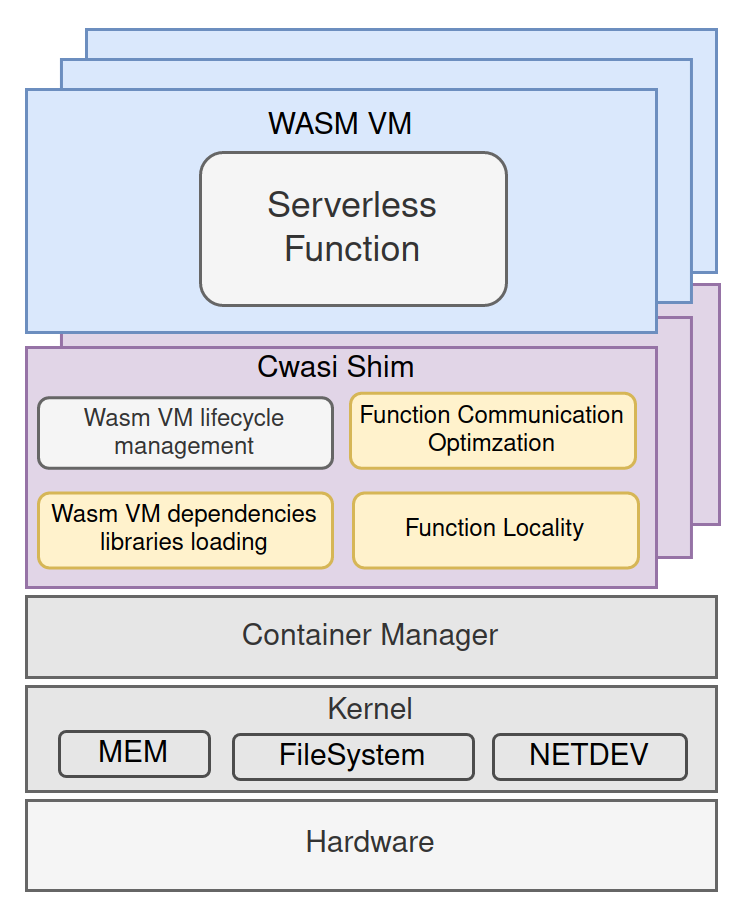

# CWASI Containerd shim

CWASI containerd shim is a lightweight and portable way to run cloud wasm applications. It leverages Wasmedge runtime to execute webassembly in a secure and sandboxed environment. We got inspired by [RunWasi Wasmedge](https://github.com/containerd/runwasi).

<p align="center">
  
</p>


## Features

* Wasm dependencies automatic loading
* Local function communication optmization via unix socket
* Remote function communication via message broker

## Prerequisites

* Rust 
* Containerd
* Wasmedge

## Installation
```
cargo build --release
```

Copy binary to $PATH
```
sudo cp target/release/containerd-shim-cwasi-v1 /usr/local/bin/containerd-shim-cwasi-v1
```

## Usage
```
Example 1
sudo crictl pull docker.io/wasmedge/example-wasi:latest
sudo ctr -n k8s.io run  --runtime=io.containerd.cwasi.v1 --annotation cwasi.secondary.function=true --net-host=true docker.io/wasmedge/example-wasi:latest cwasi /wasi_example_main.wasm 50000000

Example 2

sudo crictl pull docker.io/keniack/alice-wasm-app:latest
sudo crictl pull docker.io/keniack/my_math_lib:latest
sudo ctr -n k8s.io run --rm --runtime=io.containerd.cwasi.v1 --annotation cwasi.secondary.function=true --net-host=true docker.io/keniack/alice-wasm-app:latest cwasi /alice-wasm-app.wasm 5 10

```

## Contributing

Contributions are welcome! We would like to hear it from you. For any questions or suggestions open an issue or start a discussion. For contributions please fork this repository and open a pull request with your changes.

## License

The Cwasi Shim is licensed under the Apache License, Version 2.0. See link for the full license text.

